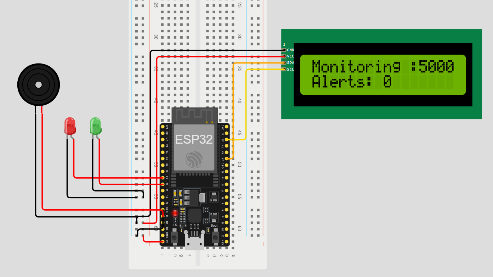

# PhantomIDS

A network security research project combining a deliberately vulnerable web honeypot with a hardware-based intrusion detection system (IDS) built on the ESP32 microcontroller — backed by a Node.js backend with a two-layer ML detection engine and a real-time admin dashboard.

---

## Project Overview

PhantomIDS consists of three interconnected components:

1. **Honeypot** — A fake corporate employee portal ("CorpNet Employee Portal") that intentionally exposes a vulnerable login endpoint to lure and record attacker behavior.
2. **Hardware IDS** — An ESP32-based device that sits on the same WiFi subnet, inspects incoming HTTP traffic in real time, and triggers physical alerts (LED, buzzer, LCD) when SQL injection payloads are detected.
3. **Backend + Dashboard** — A Node.js/Express server with SQLite (WAL mode), a trained Logistic Regression ML model for automated threat detection, a 3-Strike auto-ban engine, and a premium admin dashboard for real-time monitoring.

---

## Network Architecture

```
Attacker (Kali Linux / sqlmap)
        |
        | HTTP :5000
        v
  ESP32 PhantomIDS (192.168.1.30)   <-- Hardware IDS layer
        |
        | Forwards raw request
        v
  Node.js/Express Server (192.168.1.6:5000)
    ├── Honeypot (CorpNet Portal)    <-- Captures attack payloads
    ├── ML Engine (Logistic Reg.)    <-- Classifies THREAT / NORMAL
    ├── 3-Strike Auto-Ban Engine     <-- Bans repeat offenders
    └── Admin Dashboard              <-- Real-time monitoring
```

---

## Component 1 — Honeypot (`server/public/honeypot.html` + `server/src/routes/honeypot.js`)

### Purpose

The honeypot mimics a corporate employee self-service portal ("CorpNet Solutions Inc."). It is intentionally built with a raw, unsanitized SQL query to allow tools like `sqlmap` to successfully enumerate and dump the database. Every interaction is silently recorded and classified by the ML engine.

### Stack

- Node.js / Express
- SQLite3 via `better-sqlite3` (WAL mode for concurrent write safety)
- Vanilla HTML/CSS frontend (corporate-looking bait design)

### Database Schema

**`users`** — Seeded with fake credentials to give sqlmap real data to extract.

| Column   | Type    | Notes                        |
|----------|---------|------------------------------|
| id       | INTEGER | Primary key, autoincrement   |
| username | TEXT    | Fake username                |
| password | TEXT    | Plaintext (intentional)      |
| role     | TEXT    | admin / employee / superuser |

Pre-seeded accounts:

| Username  | Password  | Role      |
|-----------|-----------|-----------|
| admin     | admin123  | admin     |
| john.doe  | password1 | employee  |
| jane.smith| letmein   | employee  |
| root      | toor      | superuser |

**`attack_log`** — Every login attempt is recorded here with ML classification.

| Column     | Type     | Notes                                  |
|------------|----------|----------------------------------------|
| id         | INTEGER  | Primary key                            |
| ip         | TEXT     | Source IP address                       |
| method     | TEXT     | HTTP method (GET/POST)                 |
| path       | TEXT     | Request path                           |
| payload    | TEXT     | Raw username/password payload          |
| user_agent | TEXT     | Client user-agent string               |
| timestamp  | DATETIME | Date and time of the request           |
| status     | TEXT     | NORMAL / THREAT / BANNED (set by ML)   |

**`ip_tracker`** — Per-IP tracking for the ML pipeline.

| Column        | Type     | Notes                                |
|---------------|----------|--------------------------------------|
| ip            | TEXT     | Primary key (IP address)             |
| request_count | INTEGER  | Requests in current 60s window       |
| window_start  | DATETIME | Start of the current sliding window  |
| status        | TEXT     | NORMAL / THREAT / BANNED             |
| threat_count  | INTEGER  | Accumulated strike count for Model 2 |

### Vulnerable Query

The honeypot login route constructs its SQL query via direct string interpolation — no parameterization, no escaping:

```javascript
const raw = `SELECT * FROM users WHERE username='${username}' AND password='${password}'`;
```

This is the intentional attack surface. Any standard SQLi payload injected into the username or password field will be executed directly against the database.

### Routes

| Route           | Method     | Description                                                  |
|-----------------|------------|--------------------------------------------------------------|
| `/`             | GET        | Serves the landing page (`index.html`)                       |
| `/login`        | GET / POST | Honeypot login form (POST processes and logs submissions)    |
| `/honeypot`     | GET        | Direct access to the honeypot portal                         |
| `/admin/login`  | POST       | Secure admin authentication (bcrypt-hashed passwords)        |
| `/admin/me`     | GET        | Session check for dashboard auth guard                       |
| `/admin/logout` | POST       | Ends authenticated admin session                             |
| `/dashboard`    | GET        | Admin security dashboard (session-protected)                 |

### API Endpoints (Session-Protected)

| Endpoint                    | Method | Description                                          |
|-----------------------------|--------|------------------------------------------------------|
| `/api/stats`                | GET    | Dashboard stats (total attacks, unique IPs, etc.)    |
| `/api/attacks`              | GET    | Paginated attack log with filter support             |
| `/api/top-ips`              | GET    | Top attacker IPs ranked by request count             |
| `/api/timeline`             | GET    | Hourly attack timeline for the last 24 hours         |
| `/api/ban/:ip`              | POST   | Ban a specific IP address                            |
| `/api/unban/:ip`            | POST   | Unban a previously banned IP                         |
| `/api/clear-logs`           | DELETE | Reset all attack logs and IP tracker data            |
| `/api/esp32/status`         | GET    | ESP32 hardware sensor online/offline status          |
| `/api/ml/status`            | GET    | Live ML model metadata, weights, and accuracy        |
| `/api/ml/feed`              | GET    | Live threat feed from ML pipeline                    |
| `/api/severity-breakdown`   | GET    | NORMAL / THREAT / BANNED count breakdown             |

---

## Component 2 — ML Detection Engine (`server/src/ml/`)

### Two-Layer Classification Pipeline

The backend runs a two-model ML pipeline on every incoming request:

```
Incoming Request
      │
      ▼
┌─────────────────────────────────────────────────┐
│  ML Model 1 — Logistic Regression               │
│    Features: [request_rate, threat_count]        │
│    z = w1·x1_norm + w2·x2_norm + bias           │
│    P(THREAT) = sigmoid(z) = 1 / (1 + e^-z)     │
│    Label = P ≥ 0.5 → THREAT                     │
├─────────────────────────────────────────────────┤
│  ML Model 2 — 3-Strike Auto-Ban Classifier      │
│    Input: Model 1's THREAT label                 │
│    Each THREAT = 1 strike                        │
│    strike_count ≥ 3 → permanent IP ban           │
└─────────────────────────────────────────────────┘
```

### Model 1 — Logistic Regression

| Property         | Value                                    |
|------------------|------------------------------------------|
| Algorithm        | Logistic Regression (Binary Cross-Entropy)|
| Training         | Gradient Descent, 3000 epochs            |
| Feature 1        | `request_rate` (requests per minute)     |
| Feature 2        | `threat_count` (accumulated strikes)     |
| Normalization    | Min-max scaling to [0, 1]                |
| Decision         | P(THREAT) ≥ 0.5 → THREAT                |
| Accuracy         | 86.14%                                   |
| F1 Score         | 87.93%                                   |

Trained weights are saved in `server/src/ml/model.json` and loaded at server startup.

### Model 2 — 3-Strike Auto-Ban

| Property         | Value                                    |
|------------------|------------------------------------------|
| Type             | Rule-based (not ML)                      |
| Input            | THREAT label from Model 1                |
| Rule             | `strike_count ≥ 3` → permanent IP ban    |
| Rationale        | Simple, deterministic, zero false bans   |

### Training & Simulation Scripts

| Script                    | Command              | Description                            |
|---------------------------|----------------------|----------------------------------------|
| `scripts/train-model.js`  | `npm run train`      | Trains Model 1 and saves weights       |
| `scripts/attack-sim.js`   | `npm run simulate`   | Simulates sqlmap-style attack traffic  |

---

## Component 3 — Hardware IDS (`firmware/IDS_Detection.ino`)

### Purpose

The ESP32 device acts as a transparent HTTP proxy and real-time SQL injection detector. It intercepts all traffic destined for the honeypot, analyzes the request body for SQLi indicators, triggers physical alerts (LED, buzzer, LCD), and then forwards the original request to the honeypot unchanged.

### Hardware Requirements

| Component              | Details                              |
|------------------------|--------------------------------------|
| ESP32 development board | Any standard 38-pin variant         |
| 16x2 I2C LCD display   | I2C address `0x27`                   |
| Red LED                | Connected to GPIO 25                 |
| Green LED              | Connected to GPIO 26                 |
| Active buzzer          | Connected to GPIO 13                 |

### Detection Logic

The IDS uses a two-signal scoring system. Each incoming POST request body is URL-decoded and evaluated:

| Signal   | Check              | Description                                          |
|----------|--------------------|------------------------------------------------------|
| Signal 1 | Quote detection    | Presence of `'` or `"` in the decoded body           |
| Signal 2 | Keyword matching   | Presence of any SQL keyword from a 20-entry list     |

**SQL keyword list:**
`OR`, `AND`, `UNION`, `SELECT`, `INSERT`, `DROP`, `DELETE`, `UPDATE`, `FROM`, `WHERE`, `SLEEP`, `BENCHMARK`, `HAVING`, `ORDER BY`, `--`, `/*`, `#`, `1=1`, `1 =1`, `xp_`

**Scoring thresholds:**

| Score | Classification | Response                                                              |
|-------|---------------|-----------------------------------------------------------------------|
| 0     | Clean         | Green LED on, LCD shows monitoring status                             |
| 1     | Warning       | Single buzzer beep, brief LCD warning, returns to idle                |
| 2     | Critical Alert| Red LED on, triple buzzer burst, LCD shows "SQLI DETECTED" + IP      |

### Proxy Behavior

After analysis, the ESP32 opens a TCP connection to the honeypot, forwards the complete raw HTTP request, waits for the response, and relays it back to the original client. If the honeypot is unreachable, the IDS returns a `502 Bad Gateway` response.

### LCD Display States

| State              | Line 1              | Line 2                    |
|--------------------|----------------------|---------------------------|
| Boot               | `PhantomIDS v1.0`    | `Starting...`             |
| Armed / Idle       | `Monitoring :5000`   | `A:<n> W:<n> R:<n>`       |
| Warning            | `WARN: Suspicious`   | `IP:.<last octet>`        |
| Critical Alert     | `!!SQLI DETECTED!`   | `IP:<attacker IP>`        |
| Post-alert summary | `Alerts: <n>`        | `Warns: <n>`              |

### Configuration

Before flashing, update the following constants in `IDS_Detection.ino`:

```cpp
const char* SSID        = "<WiFi Name>";
const char* PASSWORD    = "<WiFi Password>";
const char* HONEYPOT_IP = "192.168.1.6";   // IP of the machine running the server
```

---

## Component 4 — Admin Dashboard (`server/public/dashboard.html`)

A premium, dark-themed security dashboard with four views:

| View           | Features                                                              |
|----------------|-----------------------------------------------------------------------|
| **Overview**   | Stats cards (total attacks, unique IPs, threats, bans), ESP32 status banner, top attacker table, 24h attack timeline chart |
| **Attack Log** | Paginated table with filter pills (All / Threats / Banned), one-click IP banning, payload preview |
| **IP Management** | Full IP lifecycle management — search, ban, unban, strike tracking |
| **ML Engine**  | Live model status, detection pipeline diagram, severity donut chart, real-time threat feed |

### Features

- **Auto-refresh**: Stats and attack log poll every 3 seconds
- **ESP32 status**: Hardware sensor online/offline badge with last ping time
- **Live ML feed**: Real-time threat detections from the logistic regression model
- **Severity chart**: SVG donut chart showing NORMAL / THREAT / BANNED distribution
- **Session auth**: bcrypt-protected admin login, 8-hour session expiry

---

## Component 5 — Landing Page (`server/public/index.html`)

A B2B product landing page with 12 sections:

1. **Hero** — Particle canvas animation, live SQLi counter, tagline
2. **Stats Bar** — Animated counters (147 attacks/session, <200ms latency, 20 signatures, 0 agents)
3. **SQLi Attack Stories** — Scroll-pinned horizontal timeline of real-world breaches (MOVEit, Equifax, etc.)
4. **Problem Statement** — Side-by-side comparison: Traditional IDS vs PhantomIDS
5. **How It Works** — 6-step system workflow with latency annotations
6. **Live Demo** — Animated terminal simulation of a sqlmap attack with ESP32 LCD response
7. **Architecture** — Three-actor network diagram
8. **ML Anomaly Detection** — Two-layer detection engine explanation
9. **Use Cases** — Internal monitoring, honeypot trap, compliance evidence
10. **Real Test Results** — Hard numbers from actual test sessions
11. **Pricing** — Open source (free) + Pre-built kit (₹1,499)
12. **Organization Registration** — Supabase-backed interest form

---

## IDS Detection Screenshot

The following screenshot shows the PhantomIDS hardware setup and LCD output during an active sqlmap scan against the honeypot:



---

## Repository Structure

```
.
├── firmware/
│   ├── IDS_Detection.ino         # ESP32 Arduino firmware (2-signal SQLi detection)
│   └── assets/
│       └── screenshot.png        # Hardware detection evidence photo
│
├── server/
│   ├── server.js                 # Express application entry point
│   ├── package.json              # Node.js dependencies and scripts
│   │
│   ├── public/                   # Static frontend files
│   │   ├── index.html            # B2B landing page (12-section, scroll-pinned timeline)
│   │   ├── dashboard.html        # Admin security dashboard (4 views)
│   │   ├── honeypot.html         # CorpNet Employee Portal (bait login)
│   │   └── login.html            # Admin login page (bcrypt auth)
│   │
│   ├── src/
│   │   ├── db/
│   │   │   └── database.js       # SQLite3 init, schema, seed data, WAL mode
│   │   │
│   │   ├── middleware/
│   │   │   ├── logger.js         # Request logging middleware
│   │   │   └── threatDetector.js # ML pipeline orchestrator (Model 1 + Model 2)
│   │   │
│   │   ├── ml/
│   │   │   ├── models.js         # ML Model 1 (Logistic Regression) + Model 2 (3-Strike)
│   │   │   └── model.json        # Trained weights, bias, normalization bounds
│   │   │
│   │   └── routes/
│   │       ├── auth.js           # Admin authentication (bcrypt, sessions)
│   │       ├── dashboard.js      # Dashboard API (stats, attacks, IPs, timeline)
│   │       ├── honeypot.js       # Honeypot login route (intentionally vulnerable)
│   │       └── mlStatus.js       # ML status API, feed, severity breakdown
│   │
│   ├── scripts/
│   │   ├── train-model.js        # Logistic Regression training script
│   │   └── attack-sim.js         # Attack traffic simulator
│   │
│   ├── data/                     # Training data directory
│   └── logs/                     # Request logs directory
│
├── Guides/                       # Project documentation and guides
├── README.md                     # This file
├── LICENSE                       # MIT License
└── .gitignore
```

---

## Getting Started

### Prerequisites

- Node.js 18+ and npm
- ESP32 development board with Arduino IDE (for hardware component)

### Running the Server

```bash
cd server
npm install
npm run dev
```

The server starts on `http://0.0.0.0:5000`. On startup it initializes the SQLite database, seeds bait users, and loads the ML model weights.

### Admin Credentials

| Username       | Password            |
|----------------|---------------------|
| phantom_admin  | PhantomAdmin@2024   |

### Available npm Scripts

| Script               | Command                          | Description                          |
|----------------------|----------------------------------|--------------------------------------|
| Start server         | `npm start` or `npm run dev`     | Runs the Node.js server             |
| Train ML model       | `npm run train`                  | Trains logistic regression model     |
| Simulate attack      | `npm run simulate`               | Runs attack traffic simulation       |
| Simulate (ESP32)     | `npm run simulate:esp32`         | Simulates with ESP32 flag            |

### Flashing the ESP32

1. Open `firmware/IDS_Detection.ino` in Arduino IDE
2. Install the `LiquidCrystal_I2C` library via Library Manager
3. Set your WiFi credentials and honeypot IP in the constants
4. Select ESP32 Dev Module as the board
5. Flash at 115200 baud

---

## Technology Stack

| Layer      | Technology                                           |
|------------|------------------------------------------------------|
| Hardware   | ESP32 DevKit V1, 16x2 I2C LCD, Active Buzzer, LEDs  |
| Firmware   | Arduino C++ (ESP32 Arduino Core, WiFi.h)             |
| Backend    | Node.js, Express 5, better-sqlite3 (WAL mode)       |
| Auth       | bcryptjs, express-session (8-hour cookie expiry)     |
| ML Engine  | Custom Logistic Regression (pure JS, no libraries)   |
| Frontend   | Vanilla HTML/CSS/JS, JetBrains Mono, Google Fonts    |
| Database   | SQLite3 with WAL mode, indexed for high-load         |
| External   | Supabase (organization registration form storage)    |

---

## Security Notice

This project is built for educational and research purposes in a controlled, isolated lab environment. The honeypot application is deliberately vulnerable. Do not deploy either component on a public network, production system, or any environment outside a dedicated security research lab.
